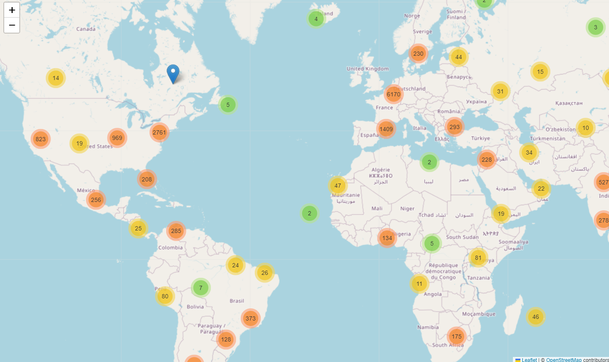
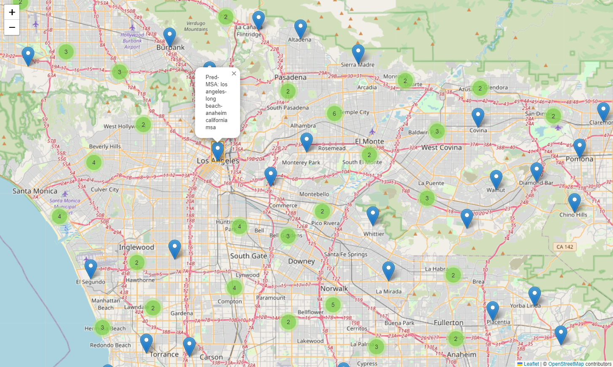

# Generalized Metropolitan Statistical Area Model

## Overview
A Metropolitan Statistical Area (MSA) groups cities with a high degree of socioeconomic ties.  Consequently, MSAs play a crucial role in demographic analysis, economic research, transportation development, and more. This Metropolitan Statistical Area Model introduces a generalized method for determining MSAs in the USA and worldwide (where countries do not have MSAs but defining them would prove beneficial), offering a practical alternative to the Office of Management and Budget's (OMB) complex criteria. The project focuses on leveraging city population and intercity distance, providing an easily interpretable and adaptable approach. By employing Density-Based Spatial Clustering of Applications with Noise (DBSCAN), the project aims to identify well-defined MSAs.
## Methodology
The model starts by considering cities with populations exceeding 50,000, utilizing readily available data such as city information, population figures, and geographical coordinates. The key methodology involves applying DBSCAN, a spatial clustering algorithm, to determine MSAs based on haversine distance. The project emphasizes the delicate balance of hyperparameters (epsilon and min_samples) to ensure meaningful MSA formation.

## Results and Comparisons
The project's findings are compared with officially designated OMB MSAs. The model predicts 280 unique MSAs in the USA, showcasing both precise matches and divergences when compared to the government's 387 MSAs. Notable differences include variations in geographical coverage and nomenclature, highlighting the subjective nature of MSA delineation.

## Visualizations
Unfortunately, GitHub is unable to fully render my ipynb file, preventing the display of the OMB's MSA map and the interactive Folium World MSA map. The visualizations below provide a glimpse of the results. For a more comprehensive understanding of the model's predicted MSAs, kindly download the ipynb file and execute it to unlock the functionality of the interactive map. 

OMB MSA Map

Predicted World MSA Map

Predicted Los Angeles-Long Beach- Anaheim MSA

## MSAs for Other Countries
The project extends its applicability to countries lacking established MSAs. Users can adapt the model for alternative intercity distance metrics, providing a foundation for socioeconomic analysis globally.

## Key Takeaways
- MSAs play a crucial role in diverse research and analyses.
- The OMB's current MSA determination involves complex procedures and data accessibility challenges.
- The proposed model offers a sensible and practical alternative, applicable not only to the USA but also globally.
- The model's parameters are easily interpretable, enhancing its adaptability for different regions.
